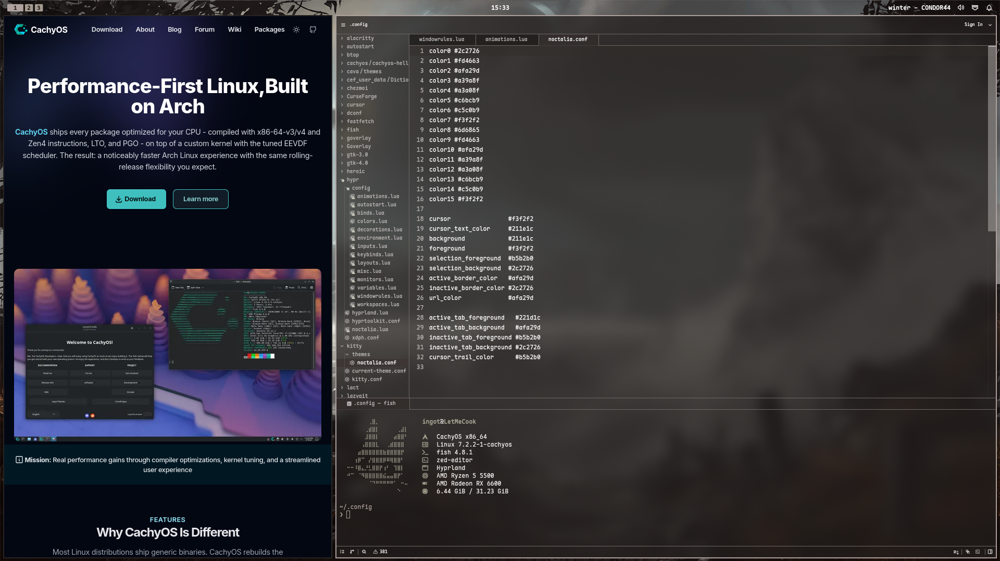
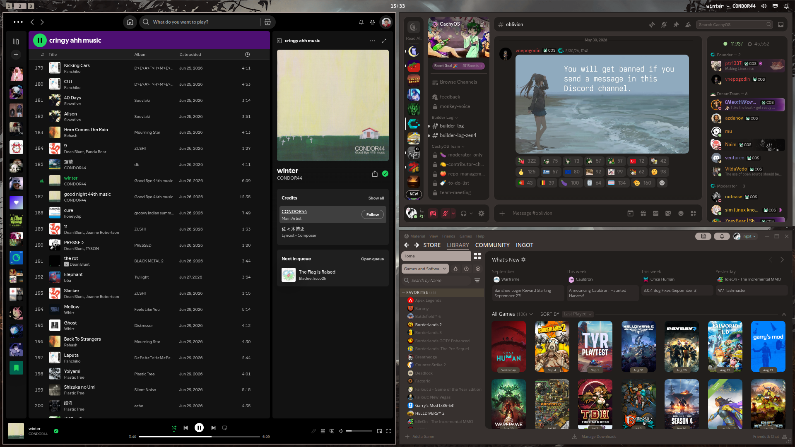
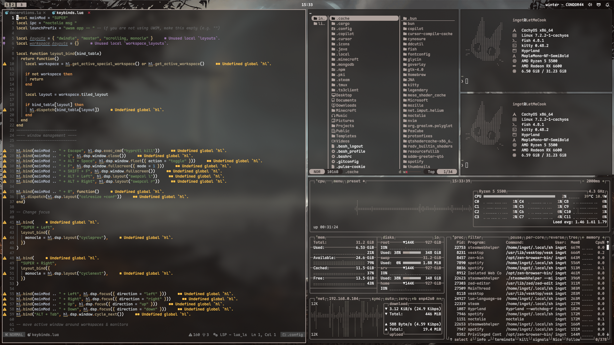
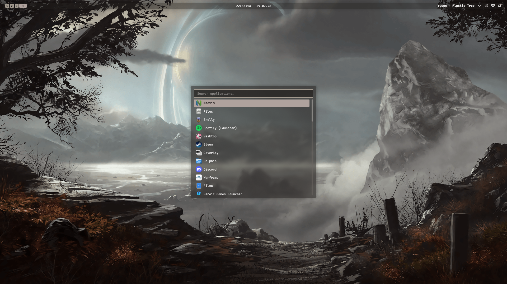

# My Dotfiles Setup

This is my first Linux rice and after spending plenty of time tweaking it to my needs, learning how to rice and getting confused on what to use i have reached a point where i am satisfied with the result

This setup is supposed to be comfortable and productive, although im jealous of other rices with huge window gaps i wanted to maximize the space available for windows, so i could have more space for text on my code editor

One day when im more experienced on ricing Linux i want to get rid noctalia and configure everything that it does separetely (rofi, waybar, matugen, swaybg, etc), not because noctalia is bad, it is very good and optimized, but for the experience and the flexibility, also that i can make my own matugen themes for apps that noctalia doesn't have templates

## Showcase
<p align="center">
  
</p>

<p align="center">
  
</p>

<p align="center">
  
</p>

<p align="center">
  
</p>


## Dependencies
List of important dependencies to know before applying the config:

[hyprland 0.55+](https://github.com/hyprwm/Hyprland), 
[Noctalia V5.0.0beta1+](https://github.com/noctalia-dev/noctalia), 
[Mapple Mono NF](https://github.com/subframe7536/maple-font), 


## Installing Packages & Applying Config

This is based on what packages already are installed in cachyOS, you can just remove any packages you don't need before running

``` bash
sudo pacman -S yay chezmoi zed zen-browser spotify-launcher yazi lazygit lazydocker ddcutil nvim httpie tmux vesktop prismlauncher lact
```

After installing the packages you can apply it using chezmoi, or by just cloning the repo and overwriting your ~/.config

```bash
chezmoi init https://github.com/igolwb/dotfiles.git
```

```bash
chezmoi apply -v
```

## Post Installation

After applying the config you'll need to configure your monitor and keyboard at ~/.config/hypr/config/inputs.lua and ~/.config/hypr/config/monitors.lua
