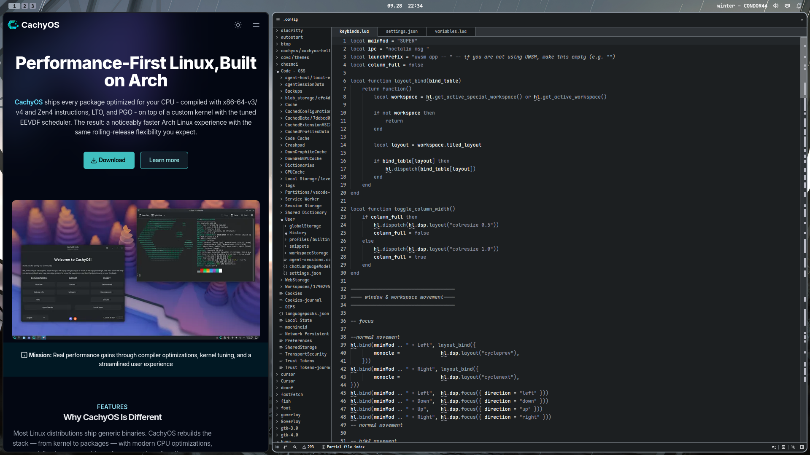
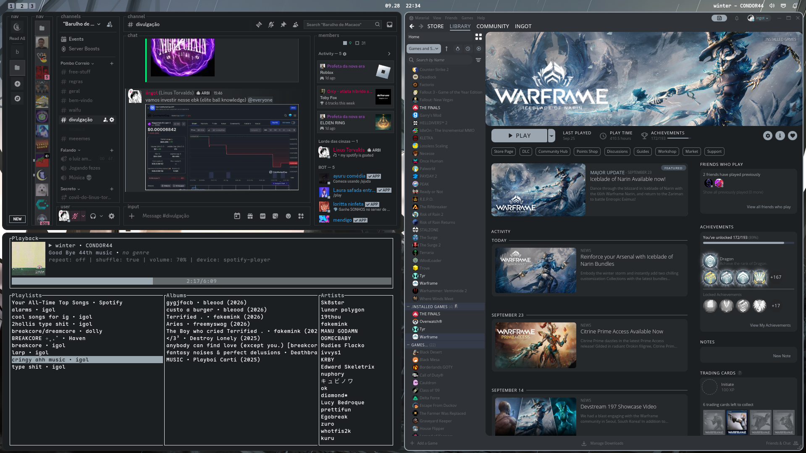
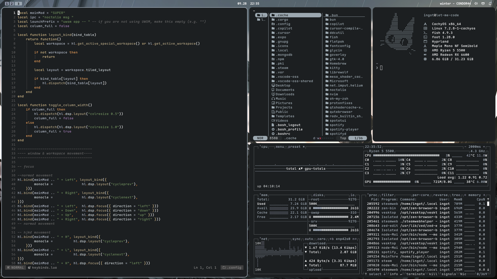
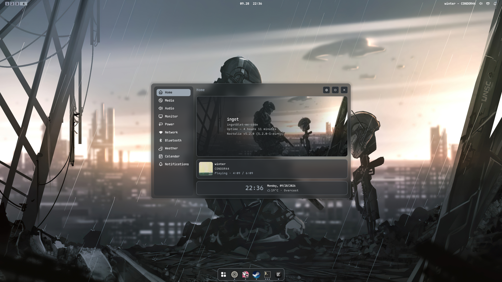

# My Dotfiles Setup

This is my first Linux rice and after spending plenty of time tweaking it to my needs, learning how to rice and getting confused on what to use i have reached a point where i am satisfied with the result

## Showcase

<p align="center">
  
</p>

<p align="center">
  
</p>

<p align="center">
  
</p>

<p align="center">
  
</p>

## Dependencies

List of important dependencies to know before applying the config:

[hyprland 0.55+](https://github.com/hyprwm/Hyprland),
[Noctalia V5.0.0beta1+](https://github.com/noctalia-dev/noctalia),
[Mapple Mono NF](https://github.com/subframe7536/maple-font),

## Installing Packages & Applying Config

This is based on what packages already are installed in cachyOS, you can just remove any packages you don't need before running

```bash
sudo pacman -S yay zed chezmoi zen-browser foot yazi lazydocker ddcutil nvim httpie vesktop rocm-smi-lib nemo nemo-fileroller spotify-player docker docker-compose docker-buildx github-cli github-copilot-cli
```

## Optional packages

```bash
sudo pacman -S protonup-qt prismlauncher lact spotify-launcher
```

After installing the packages you can apply it using chezmoi which is included in the packages script, or by just cloning the repo and overwriting your ~/.config

```bash
chezmoi init https://github.com/igolwb/dotfiles.git
```

```bash
chezmoi apply -v
```

After applying the config you'll need to configure your keyboard and monitor at [~/.config/hypr/config/inputs.lua](https://github.com/igolwb/dotfiles/blob/main/dot_config/hypr/config/inputs.lua) and [~/.config/hypr/config/monitors.lua](https://github.com/igolwb/dotfiles/blob/main/dot_config/hypr/config/monitors.lua). if you want to use spotify-player instead of the standard spotify-launcher you'll have to configure a custom client ID, follow this [link](https://github.com/aome510/spotify-player/tree/master#using-a-custom-client-id) to their github repo for custom client ID setup

Please read all of [keybinds.lua](https://github.com/igolwb/dotfiles/blob/main/dot_config/hypr/config/keybinds.lua) which is at ~/.config/hypr/config/keybinds.lua to see all of the keybinds

Also you can delete the chezmoi repo at ~/.local/share/chezmoi and the showcase screenshots at ~/showcase
